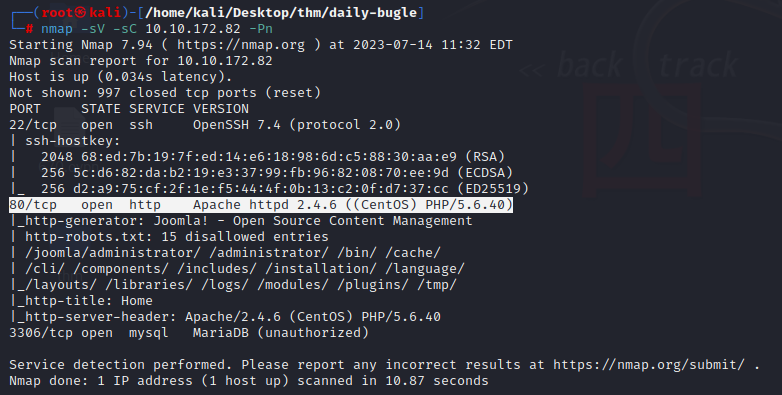
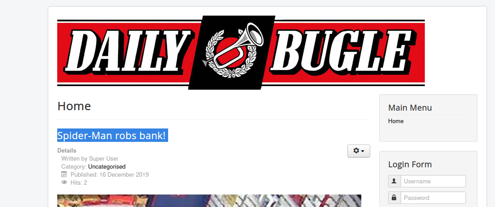
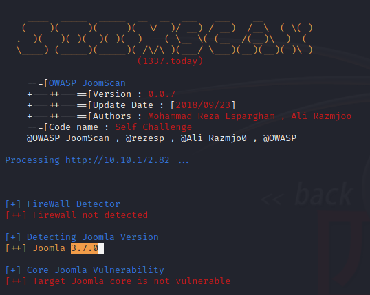
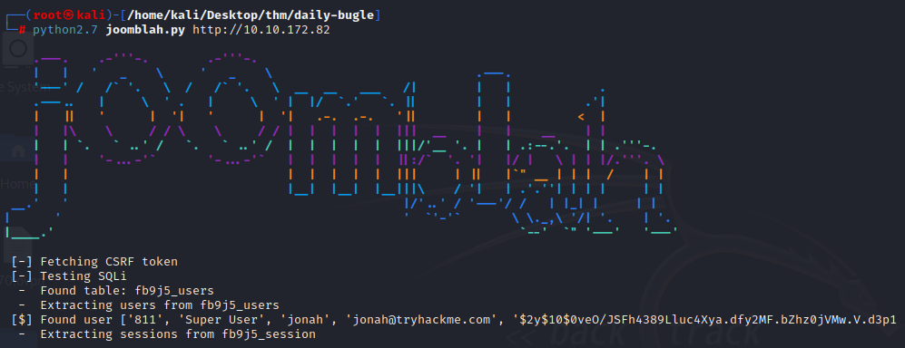
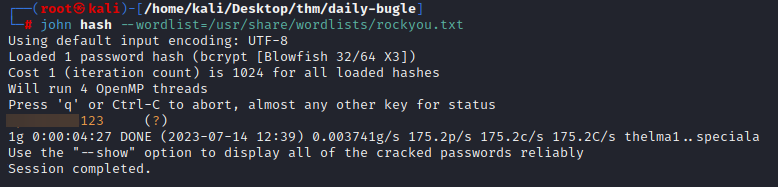
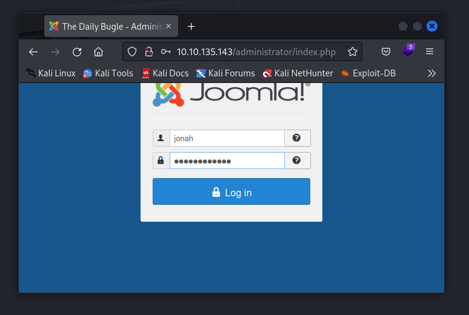
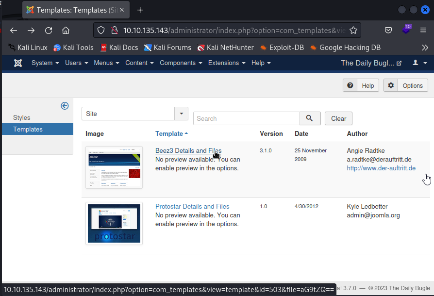
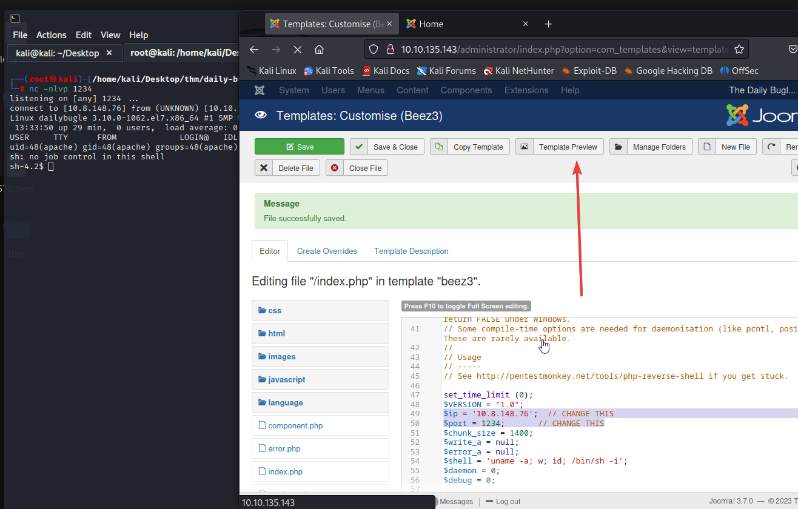
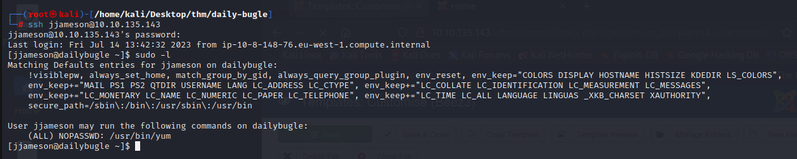
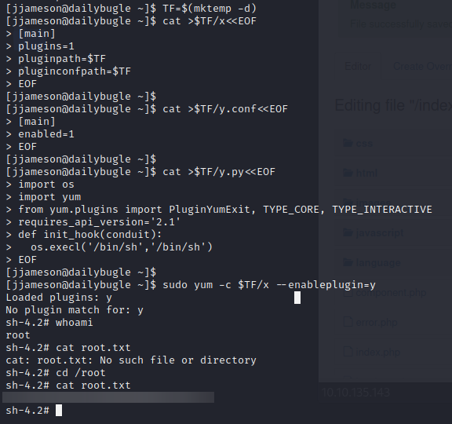

<div align="center">

# Daily Bugle Writeup


---

| Machine Name | Room URL | Difficulty |
| :--: | :--: | :--: |
| <b>Daily Bugle</b> | <a href="https://tryhackme.com/room/dailybugle">https://tryhackme.com/room/dailybugle</a> | 


---
</div>

Compromise a Joomla CMS account via SQLi, practise cracking hashes and escalate your privileges by taking advantage of yum.


# [Task 1] Deploy

## #1.1 - Access the web server, who robbed the bank?
 
Nmap reveals 3 open ports on the server:

```
nmap -sV -sC 10.10.172.82 -Pn
```


Based on the fact that port 80 (HTTP) is active, indicating the presence of a functioning web server, when we access the URL ```http://10.10.172.82``` we are presented with an article claiming that SpiderMan is involved in a bank robbery.



Answer: `spiderman`

# [Task 2] Obtain user and root

Hack into the machine and obtain the root user's credentials.

## #2.1 - What is the Joomla version?

*Hint: I wonder if this version of Joomla is vulnerable...*

To determine the Joomla version we can use **JoomScan**:

`joomscan -u http://10.10.172.82`



According to Joomscan, Joomla version is 3.7.0.

Answer: `3.7.0`

## #2.2 - What is Jonah's cracked password? (Instead of using SQLMap, why not use a python script!)

*Hint: SQLi & JohnTheRipper*

For the Joomla version 3.7.0 I decided to use [Joomblah](https://github.com/XiphosResearch/exploits/tree/master/Joomblah):




Now with the hash, let's crack it using John:



We now have Jonah's password.

## #2.3 - What is the user flag?

`The machine crashed new ip is 10.10.135.143`

Now we go to the `administrator` directory and login with `jonah:********`.



Once logged in, visit `Extensions > Templates > Templates` and select `Beez3`:



Edit `index.php` and replace the content with a PHP reverse shell, I'm using [Php-reverse-shell.php from pentest money](https://github.com/pentestmonkey/php-reverse-shell/blob/master/php-reverse-shell.php ), set a listener `nc -nlvp 1234`, then click on `Save`, and `Template Preview`



Now browse http://10.10.233.69/templates/beez3/index.php and you should get a reverse shell.

First thing on the server was to list the homes, find users (`jjameson` is the only user in `/home`), and try to find `user.txt` (common name for user flag). No luck.

Then, I inspected the `/var/www/html/` directory and extracted the following information from the `configuration.php` file, which reveals the password for the database.

~~~
sh-4.2$ cat configuration.php
cat configuration.php
<?php
class JConfig {
	public $offline = '0';
	public $offline_message = 'This site is down for maintenance.<br />Please check back again soon.';
	public $display_offline_message = '1';
	public $offline_image = '';
	public $sitename = 'The Daily Bugle';
	public $editor = 'tinymce';
	public $captcha = '0';
	public $list_limit = '20';
	public $access = '1';
	public $debug = '0';
	public $debug_lang = '0';
	public $dbtype = 'mysqli';
	public $host = 'localhost';
	public $user = 'root';
	public $password = 'nv5uz9r3ZEDzVjNu';
[REDACTED]
~~~

And by chance, this password is also the one from the jjameson's user!

~~~
sh-4.2$ su jjameson
su jjameson
Password: nv5uz9r3ZEDzVjNu

$ whoami
jjameson
$ cd
$ ls
user.txt
$ cat user.txt
**************************
~~~

User flag: `**************************`

## #2.4 - What is the root flag?

*Hint: https://gtfobins.github.io/*


Now, let's connect directly to SSH with su `jjameson:nv5uz9r3ZEDzVjNu`. First thing will be to check our privileges:



Let's check the OS:

~~~
[jjameson@dailybugle ~]$ cat /etc/redhat-release 
CentOS Linux release 7.7.1908 (Core)
~~~

The server is running on CentOS. Having a look a GTFOBins confirms several privesc with yum. Let's try.



Root flag: `**************`


