<div align="center">

# Pickle Rick Writeup


---

| Machine Name | Room URL | Difficulty |
| :--: | :--: | :--: |
| <b>Daily Bugle</b> | <a href="https://tryhackme.com/room/picklerick">https://tryhackme.com/room/picklerick</a> | 


---
</div>

A Rick and Morty CTF. Help turn Rick back into a human!


# [Task 1] Pickle Rick

## #1.1 - What is the first ingredient that Rick needs?
 

```
nmap -sV -sC 10.10.71.25 
```
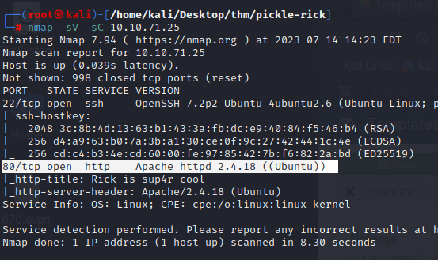

Based on the fact that port 80 (HTTP) is active, indicating the presence of a functioning web server, we can access the URL ```http://10.10.71.25 ```.

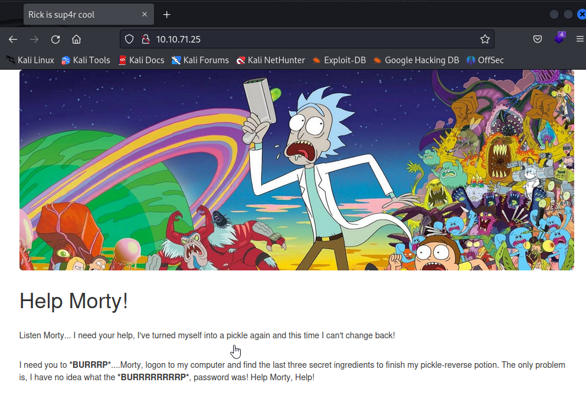

Let's do a quick check of the source code and search for hidden directories with dirb and nikto.

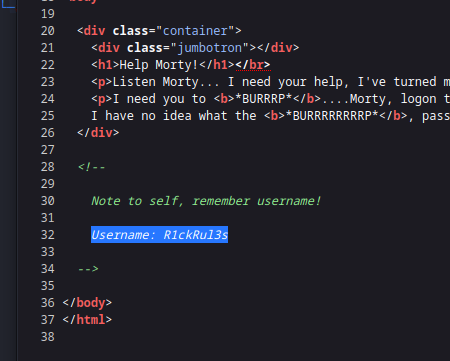
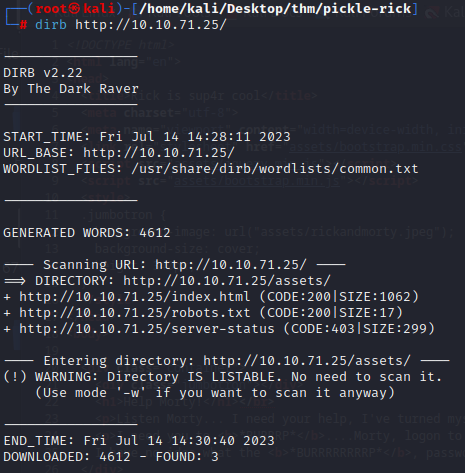
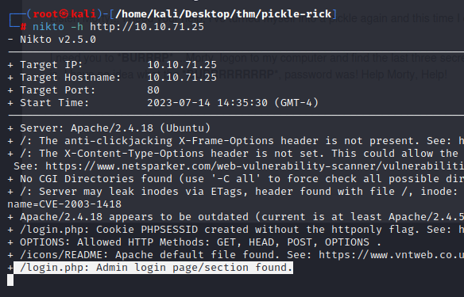
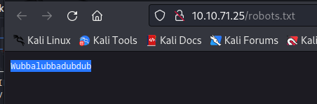

So, we found an username, maybe a password and an admin login page, so let's try.

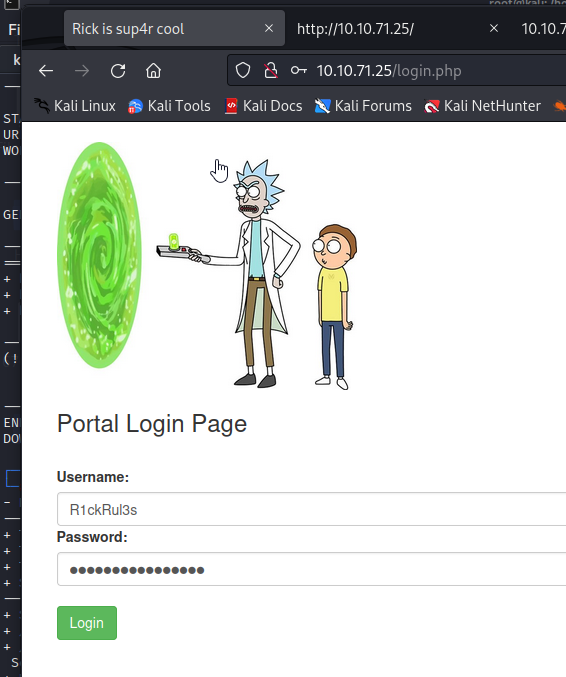

It worked ! So now we got a command pannel connected to user `www-data`

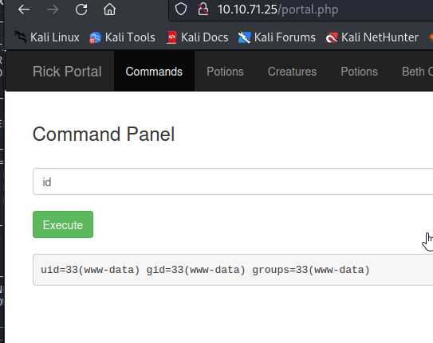

Let's try to `ls -la` to check all the files in the directory.

```
total 40
drwxr-xr-x 3 root   root   4096 Feb 10  2019 .
drwxr-xr-x 3 root   root   4096 Feb 10  2019 ..
-rwxr-xr-x 1 ubuntu ubuntu   17 Feb 10  2019 Sup3rS3cretPickl3Ingred.txt
drwxrwxr-x 2 ubuntu ubuntu 4096 Feb 10  2019 assets
-rwxr-xr-x 1 ubuntu ubuntu   54 Feb 10  2019 clue.txt
-rwxr-xr-x 1 ubuntu ubuntu 1105 Feb 10  2019 denied.php
-rwxrwxrwx 1 ubuntu ubuntu 1062 Feb 10  2019 index.html
-rwxr-xr-x 1 ubuntu ubuntu 1438 Feb 10  2019 login.php
-rwxr-xr-x 1 ubuntu ubuntu 2044 Feb 10  2019 portal.php
-rwxr-xr-x 1 ubuntu ubuntu   17 Feb 10  2019 robots.txt
```

So we found two .txt files, let's check them.

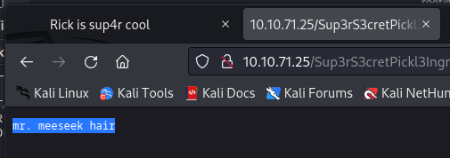

And a clue.

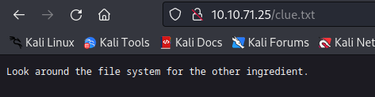

Answer: `mr. meeseek hair`

## #1.2 - What is the second ingredient in Rick’s potion?

I attempted to get a reverse shell, but each time it shuts down, no matter how hard I try. So, don't go too deep into that rabbit hole. Also, our command panel filters certain queries like "cat," "head," "tail," etc. Luckily, we still have "find" and "less" for our needs. After using "ls -la /stuff/that/linux/have" to explore directories, I discovered this.

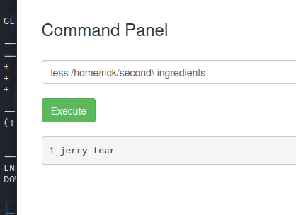

Answer: `1 jerry tear`

## #1.3 - What is the last and final ingredient?

I tried many commands to try to privesc and kept falling in a rabbit hole, in the end we just had to enter `sudo -l`

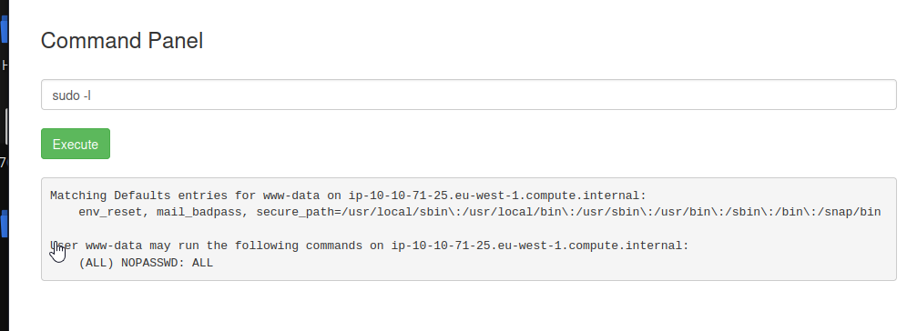

From now on we just need to open the 3rd flag by locating it.

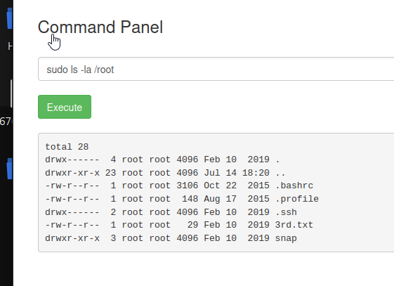
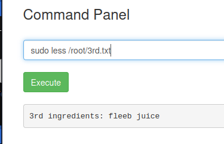

Answer: `fleeb juice`
